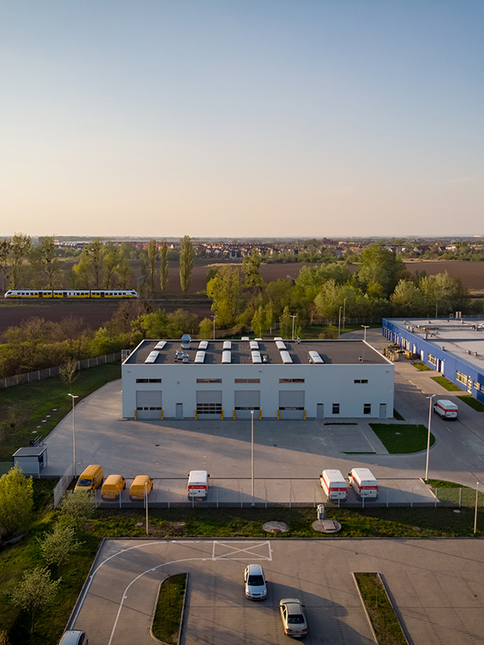

  
  <!-- CAROUSEL -->
  

  <!-- CONTENTS -->
  

  <h1>Generalny Wykonawca</h1>
  

  

    

      

        <picture>
          <source srcset="assets/img/1000x400/hala-poczta-polska.jpg" media="(min-width: 1600px)">
          <source srcset="assets/img/1000x800/hala-poczta-polska.jpg" media="(min-width: 1100px)">
          <source srcset="assets/img/1000x800/hala-poczta-polska.jpg" media="(min-width: 700px)">
          
        </picture>
      

      

        <h2>Budynki Przemysłowe</h2>
        

          

          <h4>Budujemy dla przemysłu</h4>
          
Nasze standardy jakościowe spełniaj wymagania najbardziej wymagajcych klientów z sektora przemysłowego. Dzięki umiejętności prowadzenie plac budowlanych na czynnych obiektach, od lat współpracujemy z parterami takimi jak Volvo czy Bombardier. Dopasujemy się do każdego środowiska pracy.

          

          

          <h4>Certyfikowany partner Astron</h4>
          
Jako certyfikowany partner firmy ASTRON® dostarczającej systemowe konstrukce stalowe proponujemy rozwiązania charakteryzujące się długą żywotnością oraz atrakcyjną ceną. Zaawansowane metody obliczeniowe wraz z zautomatyzowanym procesem produkcji elementów stalowychpozwalają na optymalne wykorzystanie stali.

          

        

      

    

  

  

    <h1>Zaufali Nam</h1>
  

  <!-- SLIDER -->
  

